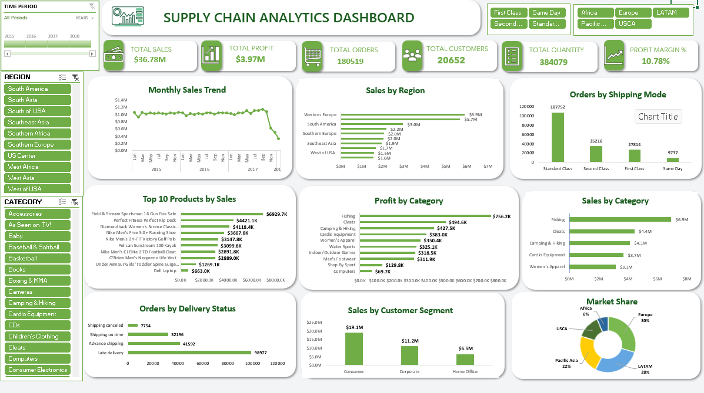

# Supply Chain Analytics Dashboard (Excel)

## Project Overview

This project is an interactive Supply Chain Analytics Dashboard built in Microsoft Excel using the DataCo Supply Chain dataset. The dashboard helps analyze sales performance, profit, customer behavior, product performance, shipping methods, and regional sales using PivotTables, PivotCharts, Slicers, and KPI cards.

---

## Objective

To build an interactive Excel dashboard that enables business users to monitor key supply chain metrics and make data-driven decisions.

---

## Dataset

- Dataset: DataCo Supply Chain Dataset
- Tool Used: Microsoft Excel

---

## Project Workflow

### 1. Data Cleaning
- Checked the dataset for missing values.
- Removed duplicate records.
- Corrected data types.
- Formatted date columns.
- Standardized text values.
- Converted sales and profit columns to currency format.

### 2. Data Preparation
- Created Excel Tables.
- Organized cleaned data into a separate worksheet.
- Prepared the dataset for PivotTables.

### 3. Pivot Tables Created
- Monthly Sales
- Sales by Region
- Profit by Category
- Sales by Category
- Orders by Shipping Mode
- Orders by Delivery Status
- Top 10 Products by Sales
- Sales by Customer Segment
- Market-wise Sales

### 4. KPI Cards
Created KPI cards for:
- Total Sales
- Total Profit
- Total Orders
- Total Customers
- Total Quantity Sold
- Profit Margin (%)

### 5. Pivot Charts
Used:
- Line Chart (Monthly Sales Trend)
- Horizontal Bar Charts
- Clustered Column Charts
- Doughnut Chart

### 6. Interactive Filters
Added slicers for:
- Region
- Category
- Shipping Mode
- Market

Added:
- Timeline Filter

### 7. Dashboard Design
- White and Green theme
- KPI cards
- Clean layout
- Interactive dashboard
- Professional formatting

---

## Dashboard Features

- Interactive slicers
- Timeline filtering
- Dynamic PivotCharts
- KPI summary cards
- Sales trend analysis
- Regional performance analysis
- Product performance analysis
- Customer segment analysis
- Shipping mode analysis
- Market analysis

---

## Skills Used

- Microsoft Excel
- Data Cleaning
- Excel Tables
- Pivot Tables
- Pivot Charts
- Slicers
- Timeline
- KPI Cards
- Dashboard Design
- Data Analysis

---

## Dashboard Preview

---

## Conclusion

This dashboard provides an interactive view of supply chain performance, helping users analyze sales, profit, customer trends, product performance, and shipping efficiency for better business decision-making.
